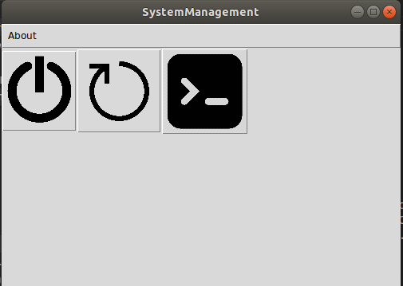

# SystemManagement

É um sistema gerencial para desligar, reiniciar e rodar comandos no terminal.

Feito para seleção da vaga de analista de desenvolvimento na vectra.

## Setup

SO: Ubuntu 17.10

Linguagem de Programação: Python3

Interface Gráfica: Tkinter

## Objetivos:

Criar um menu com interface gráfica, que deve ser aberto na inicialização do SO Linux (distros .DEB (Ubuntu, Linux Mint) / .RPM (RedHat, CentOS, Fedora, etc))
 

Este menu deve dar as seguintes opções ao usuário:

- Reiniciar (solicitar senha do usuário ROOT na UI)

- Desligar (solicitar senha do usuário ROOT na UI)

- Abrir terminal (solicitar senha do usuário ROOT na UI)

Regras:

O projeto deve ser feito em Python ou C/C++;

O código desenvolvido deve ser disponibilizado no Gitlab ou GitHub;

Deve ser indicado para qual distribuição o projeto foi feito, e como configurá-lo para que a aplicação rode na inicialização do SO Linux escolhido.

 

Entregar até 17/6/19 às 14h.

## Requisitos:

É necessário ter na máquina instalado **Python3**, **pip3** (python package manager), **Tkinter** (interface gráfica).

*instalar manualmente:*

    # via apt-get
    sudo apt install python3-tk

    # pip
    sudo pip3 install pyinstaller

    # via dnf
    sudo dnf install python3-tk

*via sh:*
    
    sh requeriments.sh

## Compilação do código:
    
*compilar manualmente:*

    pyinstaller --onefile SystemManagement.spec

*via sh:*

    sh compile.sh

## Rodar o programa

Existe uma versão já compilada do programa: **dist/SystemManagement**. Caso não queira instalar as dependencias e compilar na própria máquina. 

Para rodar o código pelo terminal: 
    
    ./SystemManagement

Ou apenas dando 2 cliques no executável. 

## Rodar o programa na inicialização do sistema operacional:

    sh compile.sh

É utilizado **crontab** do usuário, **systemd** e **~/.config/startup** no ubuntu.

o script compile.sh irá compilar o código fonte python e irá salvar o arquivo ELF compilado dentro do diretório **/usr/bin/**.

